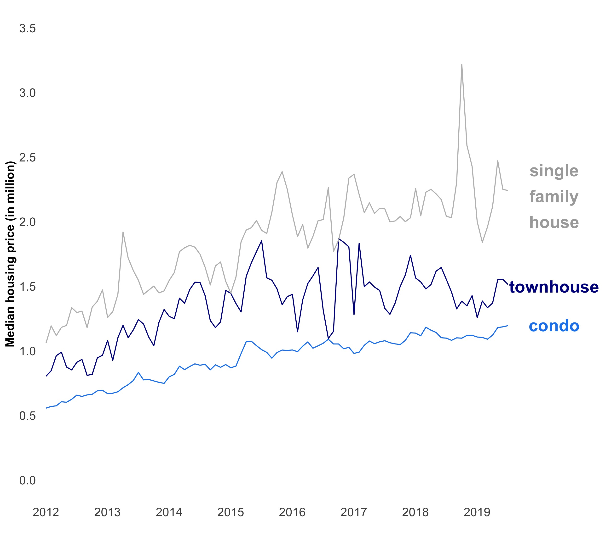
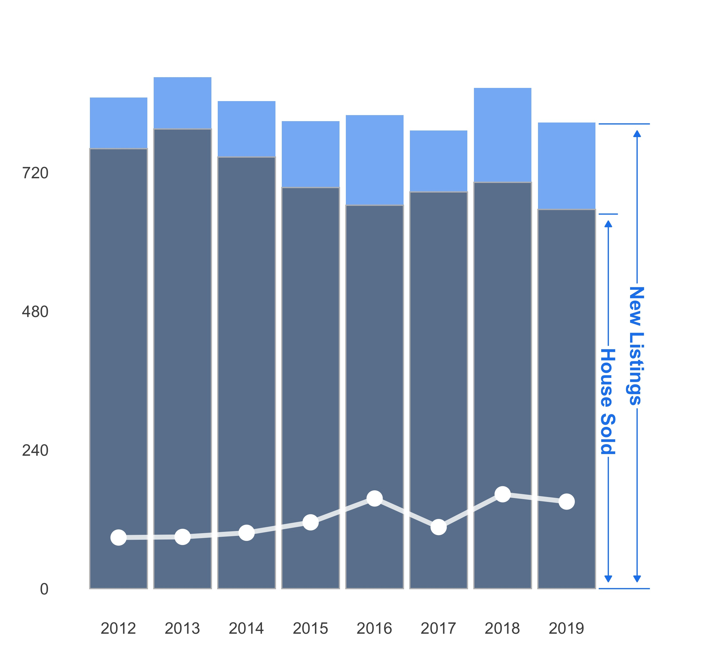
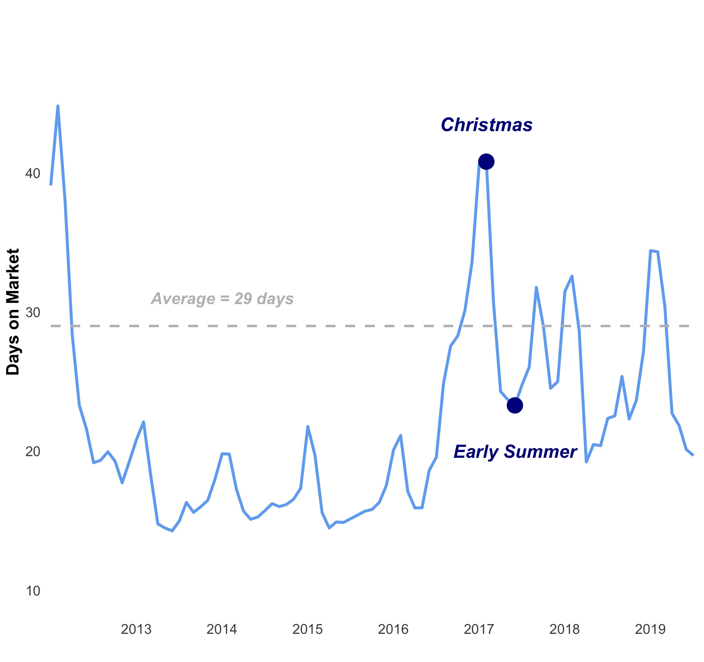
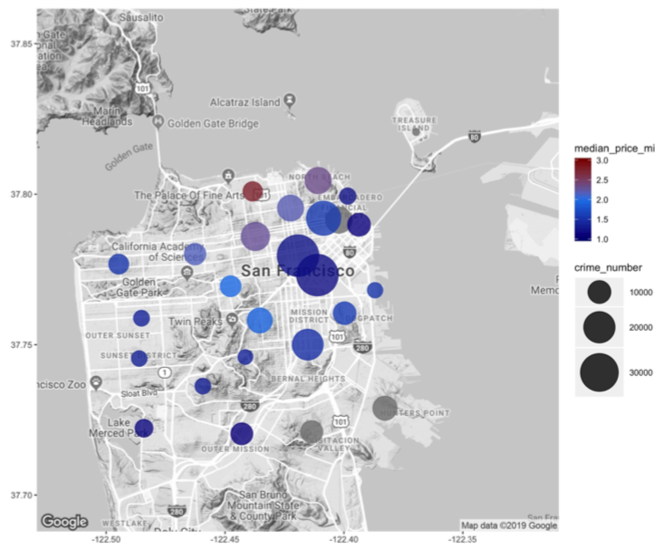
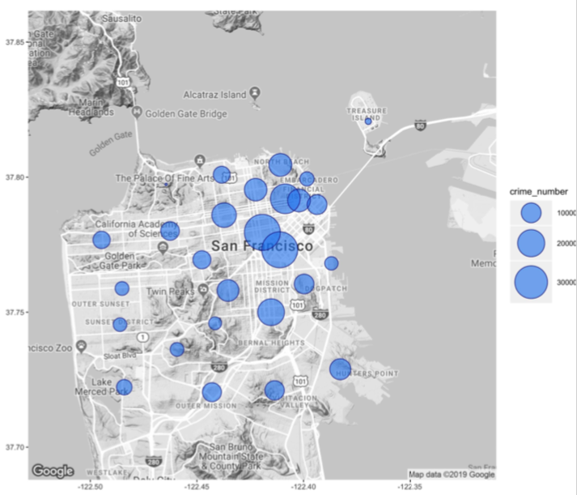
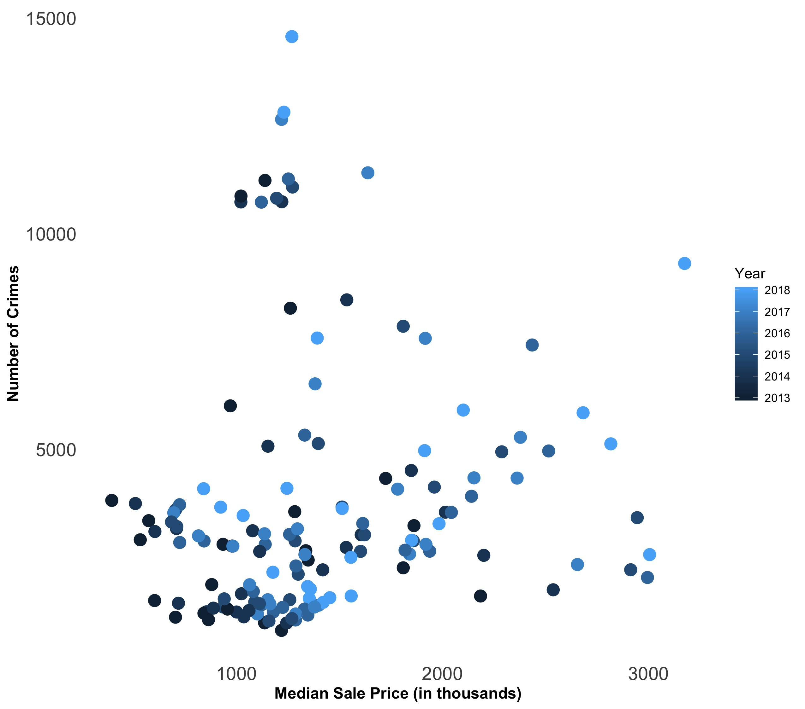
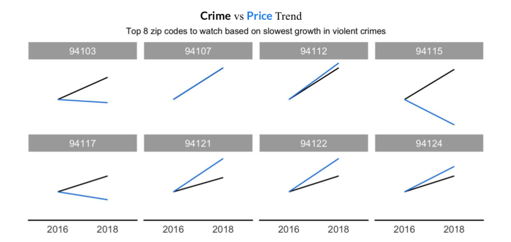

# San-Francisco-Housing-Price-Analysis

## Introduction

Here I implemented data visualization analysis upon San Francisco's house price in last 8 years.

The data source are from Redfin, US census website and USGS website. 

## Tools

The data analysis part in done with __python__, and the EDA part is done in __gg-plot__ (an R package)

## Discription

I conducted the analysis in two ways:

1. I analysis the SF housing market price trending in different house types, housing status and time. 

 
 
 
 
 
 
2. I try to find the potential purchanse opportunity by analysing the trend of crime rate and housing price in different regions (devided by zip codes) in San Francisco. 

 
 
 
 
 
 
 

The main EDA are in [], 
